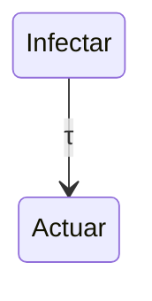
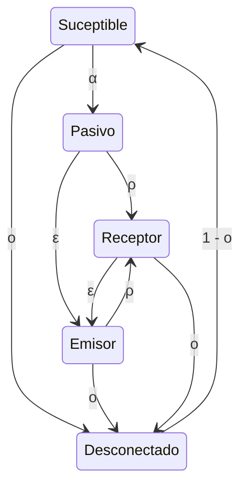

# Botnet

* Híbrida:
  * Hay un padre responsable que proporciona lista de miembros inicial (globalmente incompleta)
    * ~ centralidad local
  * Lista de miembros se actualiza con interacciones entre miembros.
  * No tiene _bootstraping_.
* Parásito
  * Usa una red _P2P_ ya estructurada.

## Notación

* $N(x)$: vecindad abierta de $x$.
* $N_S(x)$: vecindad de $x$ de nodos en el estado $S$.

## Botmaster

* En el primer paso, infecta sus vecinos.
* Finalmente, realiza el ataque.

### Estados Botmaster

* Infectar
* Actuar
* Pasivo



donde

```math
\tau(x) = \frac{|N_{I}(x)|}{|N(x)|} K
```

Donde $K$ es un coeficiente fijo de que tan ansioso está el botmaster para completar la tarea.

## Bot

* Con una dada probabilidad, se infecta si uno de sus vecinos está infecatado (_worm_ pasivo).
* Después de ser contaminado, recibe información inicial de su padre.

### Estados Bot

* Suceptible
* Pasivo
* Receptor
* Emisor
* Desconectado



### Funciones de transición

#### $\alpha$

Donde $\alpha(x)$ es la probabilidad de infección.

```math
\alpha(x) = \frac{|N_{I}(x)|}{|N(x)|} I
```

Donde $I$ es el coeficiente de infección del _worm_ usado.

#### $\omicron$

```math
\omicron(x) = O
```

Donde $O$ es un coeficiente de pérdida.

#### $\varepsilon$

```math
\varepsilon(x) = \begin{cases}
  E &\text{si botmaster actuando es vecino}\\
  \frac{|N_{P, R}(x)|}{|N_{I}(x)|} E &\text{en otro caso}
\end{cases}
```

#### $\rho$

```math
\rho(x) = \begin{cases}
  R &\text{si botmaster actuando es vecino}\\
  \frac{|N_{P, E}(x)|}{|N_{I}(x)|} R &\text{en otro caso}
\end{cases}
```

#### Pasivo

Y en `Pasivo`, se decide si se usa $\rho$ o $\varepsilon$ dependiendo de una distribución Bernoulli.

```math
\mu(\sigma) = \begin{cases}
   1 - C, &\text{si } \sigma = \rho(x)\\
   C, &\text{si } \sigma = \varepsilon(x)
\end{cases}
```
